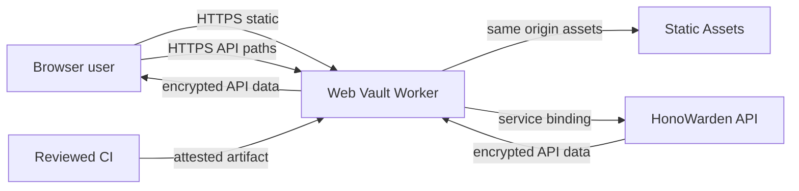

# ADR 0001: Web Vault foundation

- Status: Accepted for W1 source implementation; production activation pending
- Date: 2026-07-17
- Linear: HON-177
- Decision owners: HonoWarden maintainers

## Context

HonoWarden already exposes an API Worker at `vault.honowarden.com`; official
clients depend on that route. A separate Worker owns the public website at
`honowarden.com` and `www.honowarden.com`. A browser vault must therefore be
independently deployable and reversible without replacing either surface.

The browser will eventually process master-password-derived keys and decrypted
vault fields. An XSS, compromised dependency, accidental cache, or proxy
confusion can therefore expose the entire unlocked vault even though the API
stores encrypted payloads. The browser boundary must be approved before feature
UI and cryptography begin.

## Threat model

The ranked W1 model lives in
[docs/security/HonoWarden-Web-threat-model.md](../security/HonoWarden-Web-threat-model.md).
The architecture review in
[docs/security/w1-architecture-review.md](../security/w1-architecture-review.md)
found no unresolved high-risk architecture issue before feature UI work.

| ID     | Threat                                               | W1 control                                                                                    | Residual outside this slice                                |
| ------ | ---------------------------------------------------- | --------------------------------------------------------------------------------------------- | ---------------------------------------------------------- |
| TM-001 | XSS in an unlocked vault                             | Deny-by-default CSP, `trusted-types 'none'`, no HTML sinks, React text rendering              | W2 decrypted rendering                                     |
| TM-002 | Cross-site proxy CSRF / confused deputy              | Bearer-only auth, exact Origin, Fetch Metadata, cookie stripping                              | Future WebAuthn policy                                     |
| TM-003 | Compromised dependency or build                      | Frozen lockfile, install-script allowlist, no remote runtime assets, release manifest         | GitHub attestation becomes load-bearing after publication  |
| TM-004 | Route confusion with API or website                  | Separate hostname, no checked-in routes or deploy script, fail-closed public fallback         | Cloudflare IAM is an external production gate              |
| TM-005 | Secret persistence or telemetry                      | Memory-only session, no Web Storage/service worker, no telemetry SDK, allowlisted Worker logs | JavaScript memory cannot be zeroized                       |
| TM-006 | Malicious upstream redirect, cookie, CORS, or config | Response sanitization, same-origin config rewrite, forced `no-store`                          | Live service-binding corpus is a later activation gate     |
| TM-007 | Malicious browser extension or compromised endpoint  | Short-lived memory session, explicit lock, no durable browser secrets                         | Privileged local code is outside origin control            |
| TM-008 | Availability flood through the public Worker         | Narrow methods and paths, bounded structured logs, assumed Cloudflare/API quotas              | Explicit WAF/rate policy is operational, not a W1 code gap |

High residual items are accepted for W1 scope: TM-001 until HON-178 rendering
exists, TM-003 until CI attestation is live on the published repository, and
TM-007 because origin policy cannot defeat a compromised endpoint. They are
review gates for later slices, not unresolved W1 architecture defects.

## Decision

### Repository and runtime ownership

The Web Vault lives in the independent `HonoWarden-Web` repository. It owns:

- a React client-only application;
- a Cloudflare Worker entrypoint;
- its static assets and browser policy;
- a same-origin proxy limited to `/api/*` and `/identity/*`.

It does not own API schema, D1, R2, email, the public website, or any existing
custom domain. The proposed production hostname is `app.honowarden.com` because
live DNS readback showed it unassigned, while `vault.honowarden.com` already
serves the API. Repository creation and hostname activation remain separate
external gates.

React 19.2.7 and Vite 8.1.5 are selected because they provide a small,
well-supported client rendering surface. `@cloudflare/vite-plugin` 1.45.1
builds the Worker and Static Assets environments from one configuration. There
is no SSR: decrypted browser state must never be rendered or processed by the
edge Worker.

### API and origin boundary

The browser sees one origin. It calls only relative `/api/*` and `/identity/*`
URLs. `src/worker.ts` classifies those prefixes and constructs the upstream URL
from the operator-controlled `HONOWARDEN_API_ORIGIN`; user-controlled host,
scheme, path prefix, credentials, and fragment are never accepted.

Production requires `HONOWARDEN_API`, a Cloudflare service binding to the API
Worker. If it is absent, the proxy returns `503 api_proxy_unavailable`. A public
HTTPS fetch fallback exists only when `HONOWARDEN_API_TRANSPORT` is exactly
`public-preview` and either `HONOWARDEN_DEPLOYMENT_ENV=local` reaches a loopback
host or `HONOWARDEN_DEPLOYMENT_ENV=preview` reaches a `*.workers.dev` host. The
checked-in local configuration sets `workers_dev=false` and
`preview_urls=false`; an approved preview overlay must enable its public URL and
set `preview` explicitly. Missing, misspelled, or crossed configuration and every
custom-domain request therefore fail closed unless the service binding exists.

The Worker:

- accepts only `GET`, `HEAD`, `OPTIONS`, `POST`, `PUT`, `PATCH`, and `DELETE`;
- requires exact app `Origin` for every method except `GET` and `HEAD`;
- rejects incompatible `Sec-Fetch-Site` values;
- forwards only the API's explicit browser protocol header allowlist, including
  bearer authorization and device/login metadata;
- drops cookies, Cloudflare Access/visitor metadata, forwarding identity,
  correlation ids, and every unknown request header;
- rewrites browser `Origin` to the configured API origin after validation;
- strips upstream cookies and CORS policy from responses;
- rewrites same-API redirects back to the app origin;
- validates successful `/api/config` responses within a 64 KiB limit and
  rewrites their `vault`, `api`, and `identity` URLs to the app origin;
- emits a new UUID request id and never logs URL query, headers, or body.

The config transform accepts only the API's expected `config` object and exact
operator-configured upstream URLs. A malformed, oversized, or origin-changing
success response becomes `502 api_upstream_invalid_response`; transformed body
validators and length/encoding metadata are removed. Error responses remain
opaque proxy responses. W1 does not proxy the notification WebSocket path, so
the upstream `notifications` value remains unchanged until that transport has a
separate browser-origin and CSRF review.

The API remains responsible for token validation, resource authorization,
owner/organization scoping, payload validation, quotas, and durable audit. The
proxy is not an authorization layer and must not weaken API checks.

### Token and session storage

W1 defines `MemorySessionStore` as the only token container. Access and refresh
tokens are private in-memory strings. The observable UI snapshot exposes only
`status`, `accountLabel`, and `expiresAt`. Lock and expiry discard the object
references and notify subscribers.

Tokens and derived keys must never enter:

- query strings, fragments, path segments, or referrers;
- cookies or response headers;
- `localStorage`, `sessionStorage`, IndexedDB, Cache API, or service-worker
  storage;
- React state/props outside a dedicated auth boundary;
- rendered DOM, error messages, crash reports, analytics, console output, or
  Worker logs.

JavaScript strings cannot be reliably zeroized. Locking removes references but
does not prove immediate physical-memory erasure. Short session lifetimes,
strict XSS prevention, process isolation, and explicit user lock remain the
practical controls. HON-178 must add refresh and derived-key lifecycle without
changing this persistence invariant.

### CSP and Trusted Types

Every Worker response receives a deny-by-default policy:

```text
default-src 'none'; base-uri 'none'; connect-src 'self'; font-src 'self';
form-action 'self'; frame-ancestors 'none'; img-src 'self' data:;
manifest-src 'self'; object-src 'none'; script-src 'self'; style-src 'self';
worker-src 'self'; trusted-types 'none'; require-trusted-types-for 'script'
```

Production has no inline script/style allowance, remote origin, nonce, dynamic
Trusted Types policy, `dangerouslySetInnerHTML`, or DOM HTML sink.
`trusted-types 'none'` intentionally prevents feature code from creating a
policy as an escape hatch. Future code requiring a DOM sink must change this ADR
and pass independent security review rather than weakening CSP ad hoc.

The Worker also applies COOP `same-origin`, COEP `require-corp`, CORP
`same-origin`, HSTS at the custom-domain edge, `nosniff`, `DENY` framing,
`no-referrer`, and a restrictive Permissions Policy. All assets are same-origin,
so cross-origin isolation has no required third-party exception.

Vite's development CSS runtime injects a style element. Local `vite serve`
therefore uses Vite's `html.cspNonce` support and one fixed development-only
nonce; the Worker includes it only when `import.meta.env.DEV` is true. Build and
e2e modes emit nonce-free `style-src 'self'`. No production policy permits
`unsafe-inline`.

### CSRF and XSS model

Authentication is bearer-header based and the proxy deliberately rejects and
strips cookies. Cross-site pages therefore have no ambient credential to attach.
Unsafe methods and preflight still require the exact application origin and a
non-cross-site Fetch Metadata signal, preventing the proxy from becoming a
generic authenticated relay.

XSS remains the highest application risk because an injected script in the
unlocked page could read in-memory secrets and plaintext. Existing controls are
React text rendering, no HTML sinks, strict CSP and Trusted Types, no external
runtime code, lockfile integrity, and architecture scans. HON-178 and later
must treat every decrypted string as attacker-controlled display data, avoid
URL-based rendering, and preserve these controls under Playwright CSP tests.

### Service worker and cache policy

W1 has no service worker, PWA offline cache, Background Sync, or Cache API use.
Offline vault support would create a new durable-key and stale-mutation threat
model and requires a later ADR.

HTML, API, identity, errors, and non-fingerprinted assets use `Cache-Control:
no-store`. Only Vite fingerprinted `/assets/name-hash.ext` responses use one-year
immutable caching. A rollback therefore serves a new HTML entrypoint immediately
while old content-addressed assets remain harmless and unreferenced.

### Dependency provenance and release signing

`pnpm-lock.yaml` is the dependency authority. pnpm's minimum-release-age policy
and integrity fields are verified before build. Only `esbuild`, `workerd`, and
`sharp` may execute pinned install scripts; all other dependency build scripts
remain denied. No runtime asset is loaded from a CDN or third party.

Each release must have:

1. a reviewed source commit and green CI from a frozen lockfile;
2. passing tests, typecheck, lint, formatting, build-policy, dependency audit,
   and Playwright gates;
3. a deterministic manifest of every deployable file with SHA-256 and size;
4. a GitHub artifact attestation bound to the commit and manifest digest;
5. manual production approval and Cloudflare deployment readback.

No signing key is created or stored in this repository. GitHub OIDC artifact
attestation is the planned release-signing mechanism; deployment credentials
remain environment-scoped Cloudflare secrets. Publication and CI configuration
must pin third-party GitHub Actions by full commit SHA.

### Original design rules

The Web Vault uses an original HonoWarden visual system and information
architecture. It may implement familiar password-manager outcomes and standard
controls, but it must not copy upstream logos, proprietary illustrations,
screens, copy, CSS, layout measurements, or trade dress. Runtime icons come from
the declared Lucide dependency; no upstream visual asset is vendored.

The UI is a quiet operational tool: compact navigation, predictable state,
high-contrast controls, and explicit error/recovery states. It does not use a
marketing hero, decorative gradients, nested cards, hidden commands, or
animation as the only state signal.

### Accessibility and performance budgets

The target is WCAG 2.2 AA across keyboard, screen reader, touch, zoom, reduced
motion, high-contrast, long-label, empty/loading/error, and 320px-wide states.
Automated Playwright + axe must report zero critical or serious violations.
Every icon-only command requires an accessible name and tooltip; all focusable
controls need visible focus and at least a 38px desktop or 44px mobile target.

Production budgets for W1 are:

| Budget                            |    Limit |
| --------------------------------- | -------: |
| Initial JavaScript, gzip total    |  180 KiB |
| Initial CSS, gzip total           |   30 KiB |
| Initial same-origin requests      |        8 |
| Third-party runtime requests      |        0 |
| Layout shift in stable shell      | 0.05 CLS |
| LCP on synthetic slow 4G / 4x CPU |    2.5 s |

Budget failure blocks publication; it is not converted to a warning.

### Test strategy

- Vitest unit tests cover proxy classification, origin policy, header
  sanitization, bounded config normalization, redirect rewriting, cache
  semantics, session expiry/lock, and UI state transitions.
- Architecture tests scan source and HTML for forbidden persistence, service
  worker, dynamic DOM sinks, remote assets, production routes, and deploy
  commands.
- Build verification checks budgets, source-map absence, dev-fixture removal,
  local-only asset references, and removal of checkout-local paths from the
  generated Worker configuration.
- Playwright runs locked and synthetic authenticated shells on desktop and
  mobile, checks console/CSP/network failures, keyboard operation, axe, layout
  overflow, screenshots, and no third-party requests.
- Independent review must resolve every critical/high finding before W2 starts.
  W1 records that review in `docs/security/w1-architecture-review.md`.
- GitHub Actions CI pins third-party actions by full commit SHA, runs
  `pnpm verify` and Playwright, and has no deploy step.

### Observability

Worker logs are structured and limited to event name, generated request id,
HTTP method, normalized path class (`api`, `identity`, or `static`), response
status, rounded duration, environment, and error class. They exclude hostname,
raw path, query, headers, body, account identity, item/folder names, ciphertext,
plaintext, token, key, and upstream response body.

Operational alerts should cover proxy `5xx`, origin rejection spikes, CSP
violations collected by a future redacted endpoint, service-binding failures,
and client-side fatal error counts. W1 intentionally has no third-party
telemetry SDK. Any future error reporting adapter must redact before transport
and receive a separate data-retention review.

### Migration and rollback

W1 has no D1, R2, KV, Durable Object, or durable browser-state migration.
Deployment adds a new Worker and, only after separate approval, the new
`app.honowarden.com` hostname and API service binding.

Rollback changes only the Web Vault:

1. revert to the previous attested Worker version, or detach the app custom
   domain if the Worker cannot serve safely;
2. verify `vault.honowarden.com` API and both website hostnames were untouched;
3. invalidate only Web Vault HTML at the edge if necessary; fingerprinted assets
   need no purge;
4. preserve logs and release manifest without recording user data;
5. fix forward in a new reviewed release.

No rollback step modifies API routes, D1, R2, website routes, email, credentials,
or real vault data.

## Data flow



Decryption and plaintext rendering occur only in the browser in future slices.
The Worker and API receive credentials required for authentication and encrypted
protocol payloads, but never the master password, derived encryption key, or
decrypted vault fields.

## Consequences

Positive consequences:

- API and website availability are isolated from Web Vault rollback.
- Same-origin browser traffic avoids broad CORS and cookie-based CSRF.
- Memory-only secrets and strict browser policy reduce persistent compromise.
- Lockfile, manifest, and attestation produce a reviewable artifact chain.

Tradeoffs:

- A full page reload or browser crash locks the user and discards unsaved local
  state.
- There is no offline vault in W1.
- A service binding couples production deployment to one Cloudflare account and
  API service identity.
- CSP and Trusted Types reject libraries that depend on dynamic injection.
- JavaScript memory cannot be cryptographically zeroized.

## Rejected alternatives

- **Serve UI from `vault.honowarden.com`:** rejected because it can replace or
  regress the API route used by official clients.
- **Serve UI from the public website Worker:** rejected because Web Vault
  rollback and security policy would be coupled to public security metadata.
- **Direct cross-origin browser calls:** rejected because they require a broader
  CORS surface and split origin policy.
- **Cookie sessions:** rejected because they add ambient authority and CSRF
  complexity without solving client-side key isolation.
- **Persistent Web Storage tokens:** rejected because XSS and local-profile
  compromise survive reload and lock.
- **SSR or edge decryption:** rejected because plaintext or derived keys would
  cross the browser trust boundary.
- **Service worker now:** rejected until offline key storage, cache invalidation,
  stale mutations, and logout erasure have a dedicated threat model.

## References

- [Cloudflare Vite plugin static assets](https://developers.cloudflare.com/workers/vite-plugin/reference/static-assets/)
- [Cloudflare Worker Static Assets binding](https://developers.cloudflare.com/workers/static-assets/binding/)
- [Cloudflare service bindings](https://developers.cloudflare.com/workers/runtime-apis/bindings/service-bindings/)
- [W3C Trusted Types](https://www.w3.org/TR/trusted-types/)
- [Content Security Policy Level 3](https://www.w3.org/TR/CSP3/)
- [HonoWarden-Web threat model](../security/HonoWarden-Web-threat-model.md)
- [W1 architecture review](../security/w1-architecture-review.md)
