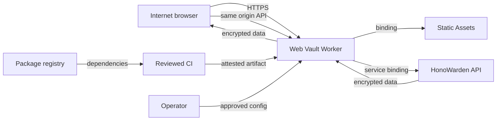

# HonoWarden Web Vault threat model

## Executive summary

The dominant risk is browser code execution while a vault is unlocked: XSS or a
compromised dependency could read in-memory tokens, future derived keys, and
decrypted fields. The next risks are proxy confusion that weakens API origin or
tenant checks, and operational routing that accidentally replaces the existing
API or website. W1 reduces these risks with a separate hostname and Worker,
strict CSP plus Trusted Types, no persistent browser secrets or external assets,
a narrow same-origin proxy, production service binding, and an attested build
plan. W2 cryptography and data rendering remain unimplemented and require a new
review against this model.

## Scope and assumptions

In scope:

- `src/worker.ts`: internet entrypoint, Static Assets adapter, and API proxy;
- `src/session/memory-session-store.ts`: browser token lifetime boundary;
- `src/App.tsx`, `src/main.tsx`, and `src/styles.css`: client shell and local-only
  preview path;
- `index.html`, `vite.config.ts`, `wrangler.jsonc`, `package.json`,
  `pnpm-lock.yaml`, and `pnpm-workspace.yaml`: browser/build/deploy policy;
- tests, release-manifest tooling, and the approval-gated release process.

Out of scope:

- HonoWarden API authentication, authorization, cryptography, D1/R2, and rate
  limiting, except as an upstream trust assumption;
- public website and inquiry inbox Workers;
- browser extensions, desktop/mobile clients, operating system compromise, and
  malicious browser extensions;
- login, KDF, vault decryption, sync, CRUD, and attachments planned for HON-178.

Assumptions used for ranking:

- the app is internet-facing at `app.honowarden.com` on the same Cloudflare
  account as the API service binding;
- the API continues to authenticate every bearer token and enforce user and
  organization ownership independently of proxy headers;
- browser plaintext is highly sensitive and can include passwords, notes, TOTP
  seeds, identity data, and attachment metadata;
- initial usage is small-team/self-hosted, but controls must not depend on low
  traffic or trusted users;
- production uses reviewed CI and an attested artifact rather than a developer
  workstation build.

Open questions that can change ranking:

- the exact production Worker service/environment name and whether Cloudflare
  Access or WAF policy will be placed in front of the app;
- the retained Worker log fields and duration in the target Cloudflare account;
- the browser support floor for Trusted Types and cross-origin isolation;
- whether future offline access is required, which would add durable key and
  cache threats.

The owner previously authorized a new repository and independent routing. No
production activation, real user, or durable browser storage was assumed.

## System model

### Primary components

- **Browser shell:** React UI that receives only a non-secret session snapshot.
  Evidence: `src/App.tsx` `App` and `AuthenticatedShell`.
- **Memory session:** private access/refresh token holder with expiry and lock.
  Evidence: `src/session/memory-session-store.ts` `MemorySessionStore`.
- **Web Vault Worker:** all-request Worker that applies policy and classifies API
  paths. Evidence: `src/worker.ts` `handleRequest` and `proxyApiRequest`.
- **Static Assets:** Vite fingerprinted HTML/CSS/JS reached through `ASSETS`.
  Evidence: `wrangler.jsonc` `assets.run_worker_first`.
- **HonoWarden API:** separately owned upstream reached through a production
  service binding. Evidence: `src/worker.ts` `HONOWARDEN_API` and
  `HONOWARDEN_API_ORIGIN`.
- **Build/release tooling:** pnpm frozen lockfile, Vite build, verification,
  release manifest, reviewed CI, and planned GitHub attestation. Evidence:
  `package.json`, `pnpm-workspace.yaml`, and `docs/supply-chain.md`.

### Data flows and trust boundaries

- Internet browser -> Web Vault Worker: HTTPS static and API requests. Cloudflare
  terminates TLS; Worker restricts methods/origin and emits fresh request ids.
- Web Vault Worker -> Static Assets: internal binding carrying asset request.
  Worker applies CSP, cross-origin isolation, and cache policy to the response.
- Browser UI -> MemorySessionStore: login results will cross in W2 as token
  strings; validation bounds length/expiry and UI receives metadata only.
- Browser -> Worker -> API: bearer token plus encrypted protocol payload over
  same-origin HTTPS then Cloudflare service binding. Worker strips ambient
  identity; API must independently validate token, scope, ownership, schema,
  quota, and state transitions.
- API -> Worker -> Browser: JSON/encrypted records and error responses. Worker
  strips cookies/CORS, rewrites same-upstream redirects, and applies `no-store`.
- Developer/CI -> dependency graph -> artifact: package metadata and install
  scripts cross a supply-chain boundary. Frozen integrity, a three-package build
  allowlist, tests, manifest, review, and attestation constrain it.
- Operator -> Cloudflare configuration: service binding and custom-domain route
  are privileged deployment inputs. They require separate approval and exact
  post-deploy route readback.

#### Diagram

## Assets and security objectives

| Asset                                              | Why it matters                                                  | Security objective (C/I/A) |
| -------------------------------------------------- | --------------------------------------------------------------- | -------------------------- |
| Access and refresh tokens                          | Permit account and vault API access                             | C, I                       |
| Future derived keys and plaintext vault fields     | Compromise can expose all stored credentials and secrets        | C, I                       |
| Encrypted vault payloads                           | Tampering or replay can destroy or corrupt user state           | I, A                       |
| User/organization identity and metadata            | Sensitive account and tenancy information                       | C, I                       |
| API authorization boundary                         | Prevents cross-user and cross-organization access               | C, I                       |
| Web Vault and API route availability               | Users and official clients depend on separate stable routes     | A                          |
| CSP/origin/deployment configuration                | A policy weakening can convert a code bug into vault compromise | I                          |
| Source, lockfile, build artifact, and attestations | Establish what code reached users                               | I                          |
| Redacted operational logs                          | Needed for incident response without becoming a secret store    | C, I, A                    |

## Attacker model

### Capabilities

- An unauthenticated remote attacker can send arbitrary HTTP methods, paths,
  headers, origins, bodies, and request volume to the public Worker.
- An authenticated malicious user can submit encrypted fields and future display
  strings that another browser may render through shared organization features.
- A website can induce cross-site browser requests and preflight attempts.
- A compromised npm maintainer or registry path can publish malicious package
  content or install scripts under a new version.
- A phished or malicious operator with deployment credentials can alter routes,
  service bindings, variables, or artifacts.
- A network observer cannot break correctly configured HTTPS or Cloudflare
  service bindings, but can observe public timing and availability.

### Non-capabilities

- The attacker is not assumed to control Cloudflare's platform, GitHub's
  attestation root, the user's operating system, or the browser binary.
- A normal remote attacker cannot read JavaScript memory without first obtaining
  code execution in the origin or controlling a privileged browser extension.
- The Worker has no D1/R2 binding and cannot directly read durable vault data.
- W1 has no login, decryption, upload parser, service worker, offline cache, or
  real account path to attack.
- The proxy does not grant authorization by itself; successful cross-tenant
  access also requires an API authorization defect or stolen token.

## Entry points and attack surfaces

| Surface                | How reached                                  | Trust boundary                    | Notes                                                  | Evidence (repo path / symbol)                        |
| ---------------------- | -------------------------------------------- | --------------------------------- | ------------------------------------------------------ | ---------------------------------------------------- |
| Static route           | Any non-API HTTPS path                       | Internet -> Worker -> assets      | SPA fallback; strict headers; HTML no-store            | `src/worker.ts` `handleRequest`, `secureResponse`    |
| `/api/*`               | Same-origin fetch or arbitrary HTTP client   | Browser/internet -> proxy -> API  | Method and origin checks; bearer forwarded             | `src/worker.ts` `classifyApiPath`, `proxyApiRequest` |
| `/identity/*`          | Same as API                                  | Browser/internet -> proxy -> API  | Future login/token requests; high-value body           | `src/worker.ts` `classifyApiPath`                    |
| Proxy environment      | Cloudflare operator config                   | Operator -> Worker                | HTTPS origin parsed; binding default; preview opt-in   | `src/worker.ts` `parseApiOrigin`, `WebVaultEnv`      |
| Session open/lock      | Future auth code in same JS realm            | Auth module -> memory store -> UI | Tokens private; snapshot non-secret; JS cannot zeroize | `src/session/memory-session-store.ts`                |
| React-rendered strings | Future decrypted or shared item values       | API/user data -> DOM              | React escaping and Trusted Types; W2 rendering absent  | `src/App.tsx`, `src/worker.ts` `SECURITY_HEADERS`    |
| Local preview          | localhost development path only              | Developer -> synthetic session    | Removed from production by `import.meta.env.DEV`       | `src/main.tsx`                                       |
| Dependency install     | `pnpm install` and package lifecycle scripts | Registry -> developer/CI          | Integrity and three-package script allowlist           | `pnpm-lock.yaml`, `pnpm-workspace.yaml`              |
| Build artifact         | Vite/Worker bundle                           | CI -> Cloudflare                  | Manifest/attestation required before production        | `vite.config.ts`, `docs/supply-chain.md`             |

## Top abuse paths

1. **Steal an unlocked vault through XSS:** attacker stores or injects a crafted
   display value -> feature code sends it to an unsafe DOM sink -> injected code
   reads tokens/keys/plaintext from the JS realm -> exfiltrates via an allowed
   channel. Current Trusted Types and CSP block sinks/channels, but W2 rendering
   is the decisive review point.
2. **Compromise the build:** attacker publishes a malicious dependency version
   -> lockfile update or install script is accepted without provenance review ->
   bundle captures secrets at runtime -> attested but insufficiently reviewed
   artifact reaches users.
3. **Use the proxy as a confused deputy:** cross-site page invokes an unsafe API
   path -> proxy forwards ambient authorization/cookies or trusts spoofed origin
   -> API state changes under victim authority. Cookie stripping and exact
   origin/Fetch Metadata checks break this path.
4. **Redirect secrets off-origin:** upstream or compromised response returns a
   crafted redirect/cookie/CORS header or config URL -> browser follows, stores,
   or calls it with authority -> token or identity crosses origin. Response
   sanitization limits redirects to the configured API origin, strips
   ambient-policy headers, and validates/normalizes browser API config URLs.
5. **Replace the official API by routing mistake:** operator attaches Web Vault
   to `vault.honowarden.com` -> official clients receive HTML or proxy loops ->
   login/sync outage. Separate repo ownership, absent checked-in routes, and
   route readback are required controls.
6. **Persist secrets after lock:** feature code stores token/key/plaintext in Web
   Storage, IndexedDB, Cache API, service worker, URL, or telemetry -> user locks
   the UI -> attacker later retrieves durable data. Architecture scans and no
   service worker block the known W1 paths.
7. **Bypass API tenancy with proxy headers:** attacker supplies spoofed forwarding
   or host headers -> upstream mistakes them for trusted identity -> cross-user
   access. Proxy forwards only the explicit browser protocol header allowlist;
   API must never authorize from edge or forwarding metadata.
8. **Exhaust API through the proxy:** attacker floods allowed GET paths or many
   rejected requests -> Worker/API quotas or logs are exhausted -> users lose
   availability. Cloudflare/API rate controls and bounded logs are still needed
   operationally.

## Threat model table

| Threat ID | Threat source                                              | Prerequisites                                                                                               | Threat action                                                                                | Impact                                                        | Impacted assets                           | Existing controls (evidence)                                                                                                        | Gaps                                                                                  | Recommended mitigations                                                                                                                               | Detection ideas                                                                      | Likelihood | Impact severity | Priority |
| --------- | ---------------------------------------------------------- | ----------------------------------------------------------------------------------------------------------- | -------------------------------------------------------------------------------------------- | ------------------------------------------------------------- | ----------------------------------------- | ----------------------------------------------------------------------------------------------------------------------------------- | ------------------------------------------------------------------------------------- | ----------------------------------------------------------------------------------------------------------------------------------------------------- | ------------------------------------------------------------------------------------ | ---------- | --------------- | -------- |
| TM-001    | Remote or authenticated content attacker                   | A future feature renders attacker-influenced decrypted/shared text and contains a DOM/code-injection defect | Execute script in the unlocked origin and read memory                                        | Full vault/token disclosure and state mutation                | Tokens, keys, plaintext, API boundary     | Strict CSP/Trusted Types in `src/worker.ts`; no HTML sinks via `test/architecture.test.ts`; React text rendering in `src/App.tsx`   | W2 rendering and cryptography do not exist; browser extensions remain outside control | Keep `trusted-types 'none'`; centralize safe rendering; fuzz long/hostile strings; CSP Playwright tests; independent review on every new sink         | Redacted CSP violation counts, fatal UI errors, anomalous token use from new devices | Medium     | High            | high     |
| TM-002    | Cross-site attacker                                        | Victim has an authenticated session and proxy accepts ambient authority or spoofed origin                   | Induce unsafe API mutation through Web Vault proxy                                           | Unauthorized create/update/delete or session action           | API state, encrypted records, tokens      | No cookies; exact Origin and Fetch Metadata checks; method allowlist; header stripping in `src/worker.ts`                           | Browser compatibility and future WebAuthn may require policy changes                  | Keep bearer-only auth; add integration tests for every auth/mutation method; reject `null` origin; never add wildcard CORS                            | Count origin rejects by path class only; alert on sudden increase                    | Low        | High            | medium   |
| TM-003    | Compromised package maintainer, registry, or CI dependency | Malicious version or install script enters reviewed dependency graph                                        | Insert runtime credential capture or artifact tampering                                      | Full unlocked-vault compromise across all users               | Source, artifact, tokens, plaintext       | Frozen integrity lockfile and `allowBuilds` in `pnpm-workspace.yaml`; no remote assets; planned manifest/attestation                | CI workflow and attestation are not active until repository publication               | Pin Actions by SHA; review lockfile diffs/licenses; production audit/SBOM; attest exact manifest; two-person dependency updates                       | Dependabot/registry advisories, attestation mismatch, unexpected bundle hash/size    | Medium     | High            | high     |
| TM-004    | Operator error or compromised deployment identity          | Ability to modify custom domains, Worker routes, variables, or bindings                                     | Attach Web Vault to API/website hostname or wrong backend                                    | Official-client/API/website outage; possible policy confusion | Route availability, API boundary          | No routes/deploy script/public URL by default; separate app hostname; binding default; strict local/preview host pairing            | Actual Cloudflare IAM and route policy are external and unverified                    | Least-privilege deployment token; preview first; before/after route snapshot; prohibit API/website patterns in CI; one-command prior-version rollback | Synthetic health checks for all four hostnames; route-change audit alerts            | Low        | High            | medium   |
| TM-005    | Feature developer or injected code                         | Secret value is passed to persistence, URL, error, or telemetry                                             | Retain data beyond lock/session or leak through logs/referrer                                | Delayed credential/plaintext disclosure                       | Tokens, keys, plaintext, identities, logs | Memory-only store; no service worker/storage/sinks architecture scan; no-referrer; no-store; normalized logs                        | W2 adds far more data paths; JS memory is not zeroizable                              | Taint-oriented review for token/key/plaintext types; dedicated redaction adapter; browser storage inspection after each lifecycle test                | Automated storage/cache/URL assertions; sampled schema-only log audits               | Low        | High            | medium   |
| TM-006    | Compromised upstream or response-splitting bug             | API returns malicious cookie, CORS, redirect, config URL, or cache metadata                                 | Cause browser to store ambient state, call/follow an off-origin URL, or cache sensitive data | Session confusion, data exposure, phishing                    | Tokens, identity, response integrity      | Cookie/CORS stripping; same-origin redirect rewrite; bounded config schema/origin normalization; forced no-store in `src/worker.ts` | Full upstream corpus has not been live-tested through a service binding               | Add fixtures for multiple `Set-Cookie`, malformed Location/config, 204/304, streaming, content-disposition; reject off-origin policy explicitly       | Proxy status plus invalid-config and sanitized-redirect counters without raw URL     | Low        | Medium          | medium   |
| TM-007    | Malicious browser extension or compromised endpoint        | Code execution with browser/profile privileges                                                              | Read page memory/DOM or instrument crypto operations                                         | Full unlocked-vault disclosure                                | Tokens, future keys/plaintext             | Short-lived memory session, explicit lock, no durable browser secrets                                                               | Origin controls cannot defeat privileged local code                                   | Document endpoint trust; optional isolated profile guidance; auto-lock and re-auth for sensitive actions in W2                                        | New-device/session anomaly and re-auth events from API                               | Medium     | High            | high     |
| TM-008    | Remote unauthenticated attacker                            | Public app and proxy are reachable                                                                          | Flood static/API paths or induce expensive upstream work/log volume                          | App/API degradation and alert fatigue                         | Availability, quotas, logs                | Cloudflare edge, narrow paths, method limit, bounded structured logs; upstream quotas assumed                                       | W1 has no explicit WAF/rate policy or load evidence                                   | Configure per-path Cloudflare rate limits; preserve trustworthy client address through service binding; load test rejection and API paths             | 429/5xx, Worker CPU, request rate, upstream latency, log volume                      | Medium     | Medium          | medium   |

## Criticality calibration

- **Critical:** reliable pre-auth remote code execution in the Worker; silent
  artifact compromise affecting every user; cross-tenant plaintext/key exposure
  without victim interaction.
- **High:** XSS that steals an unlocked vault; token theft enabling durable vault
  access; API authorization bypass across users/organizations; malicious signed
  production bundle.
- **Medium:** targeted proxy CSRF with constrained mutation; API/website route
  outage with documented rollback; sensitive metadata retained in logs; bounded
  authenticated denial of service.
- **Low:** policy/header disclosure without secret data; noisy invalid requests
  absorbed at the edge; UI-only defects with no integrity or availability impact.

Priority reflects current W1 controls and assumptions, not just raw impact.
TM-001 and TM-003 remain high because future plaintext and tokens share the JS
realm. TM-004 is medium because route mutation requires privileged operator
access and rollback is isolated.

## Focus paths for security review

| Path                                  | Why it matters                                                                                         | Related Threat IDs             |
| ------------------------------------- | ------------------------------------------------------------------------------------------------------ | ------------------------------ |
| `src/worker.ts`                       | Internet entrypoint, origin/method decisions, request/response sanitization, logging, and cache policy | TM-002, TM-004, TM-006, TM-008 |
| `src/session/memory-session-store.ts` | Sole W1 token lifetime and UI declassification boundary                                                | TM-001, TM-005, TM-007         |
| `src/main.tsx`                        | Connects session to React and contains the compile-time local preview branch                           | TM-001, TM-005                 |
| `src/App.tsx`                         | Future decrypted values will reach this rendering layer                                                | TM-001, TM-005                 |
| `index.html`                          | Initial script authority and CSP compatibility surface                                                 | TM-001, TM-003                 |
| `wrangler.jsonc`                      | Worker identity, all-request asset policy, environment, and future binding configuration               | TM-004, TM-008                 |
| `vite.config.ts`                      | Defines deployable Worker/client build and source-map behavior                                         | TM-003, TM-005                 |
| `package.json`                        | Direct executable dependency and verification command inventory                                        | TM-003                         |
| `pnpm-lock.yaml`                      | Exact transitive code and integrity authority                                                          | TM-003                         |
| `pnpm-workspace.yaml`                 | Install-script allowlist and minimum-release-age exceptions                                            | TM-003                         |
| `test/worker.test.ts`                 | Executable proxy and browser-policy contract                                                           | TM-002, TM-006, TM-008         |
| `test/architecture.test.ts`           | Prevents persistent-secret and injection-surface drift                                                 | TM-001, TM-005                 |
| `docs/deployment.md`                  | Privileged route/binding activation and rollback sequence                                              | TM-004                         |
| `scripts/verify-build.mjs`            | Detects dev fixture, remote assets, source maps, and budget drift in artifact                          | TM-003, TM-005                 |
| `scripts/release-manifest.mjs`        | Binds release review and attestation to exact deployable bytes                                         | TM-003                         |

## Quality check

- Covered both runtime entrypoint prefixes, static fallback, session entry,
  environment configuration, local preview, dependency install, and release.
- Represented every identified browser/Worker/API/build/operator trust boundary
  in at least one threat.
- Separated production runtime, developer-only preview, build/CI, tests, and
  external API responsibilities.
- Recorded owner-authorized repository/routing assumptions and unresolved
  production service-name, retention, browser-floor, and offline questions.
- No secret, real identity, private payload, or production credential was read or
  included in this model.
